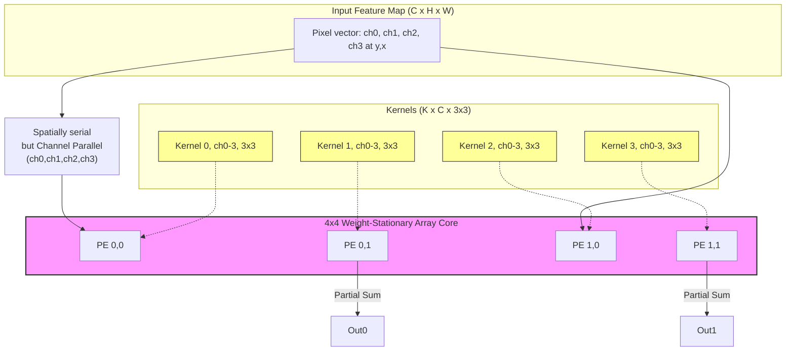
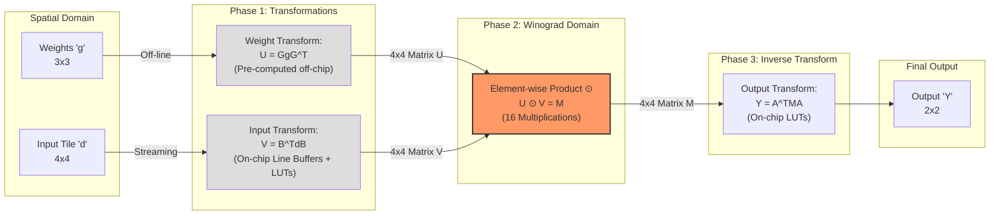
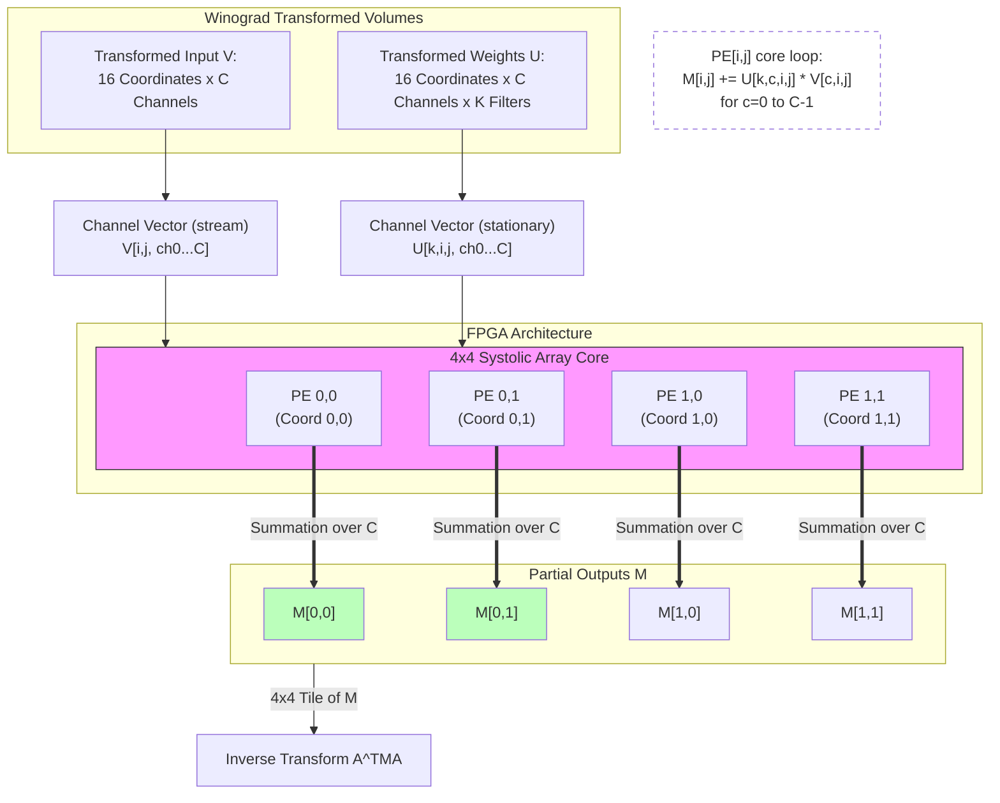

# DVCon Accelerator

FPGA-based YOLO Winograd accelerator research and RTL prototype.

## Project Links

- Model repository: [Main model (software approach)](https://github.com/BimsaraU/DVCon-SittingDucks)
- Relevant project links:
  - [K-graph approach](https://github.com/thilakshan2003/DVCON-kgraph_for_coco)
  - <add link here>
  - <add link here>

## Project Summary So Far

Project Status: FPGA-Based YOLO Winograd Accelerator

Current Milestone Achieved:
Designed and verified a scalable $4 \times 4$ systolic array core for independent matrix operations.

Immediate Next Step:
Validated a single-tile Winograd $F(2,3)$ proof of concept, executing $U \odot V$ element-wise multiplication on the array hardware.

Next Steps:
- Line buffer subsystem for streaming $4 \times 4$ tiles from feature maps.
- Zero-DSP transform blocks for $B^TdB$ and $AfA^T$.
- Tiling and memory optimization for deeper YOLO channel sizes.

Target Objective:
Complete single-layer hardware execution and compare Winograd vs. standard spatial convolution for throughput and energy.

## Existing Work

I started from a fixed-point PE and built a 4x4 systolic array around it. The PE handles the multiply-accumulate step, and the array organizes those PEs into a reusable compute block for matrix-style operations.

The Winograd path sits on top of that hardware. It uses the array for the element-wise product stage, with separate input and weight transforms around it. I have a solid understanding of how CNN convolution maps onto systolic arrays and how Winograd fits into that flow, but a few integration details are still being refined.

## Architecture Notes



    **Diagram 1 — Channel-to-hardware mapping:** A 2D 4×4 systolic array maps channel vectors (C) across PEs to compute multiple output filters (K) in parallel. Weights stay stationary while activations stream through the array.




    **Diagram 2 — Winograd transform flow:** We pre-transform weights (U) and transform input tiles (V), perform 16 element-wise multiplications (U ⊙ V), then inverse-transform to produce the final 2×2 output. Transforms use simple constants (1, −1, 2), making them cheap to implement in logic.




    **Diagram 3 — Channel summation on the array:** Each Winograd tile coordinate (i,j) is computed by summing per-channel products across C: $\\mathrm{Result}_{i,j}=\\sum_{c} U_{i,j,c}\\cdot V_{i,j,c}$. The 16 coordinates are independent and map directly to PEs for parallel accumulation.


## Simulation Screenshots


## Existing Commands

```bash
make sim
make wave
make lint
make clean
```

## Notes

- The current RTL is still a work in progress.
- Some naming and integration details are still being aligned.
- The goal is to keep the benchmark small, clear, and easy to compare against standard convolution.